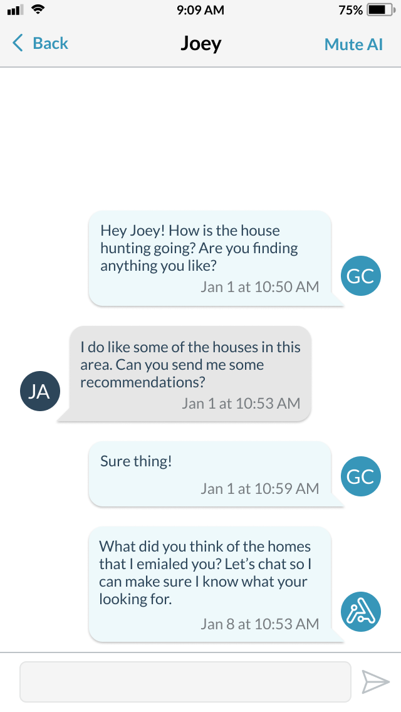
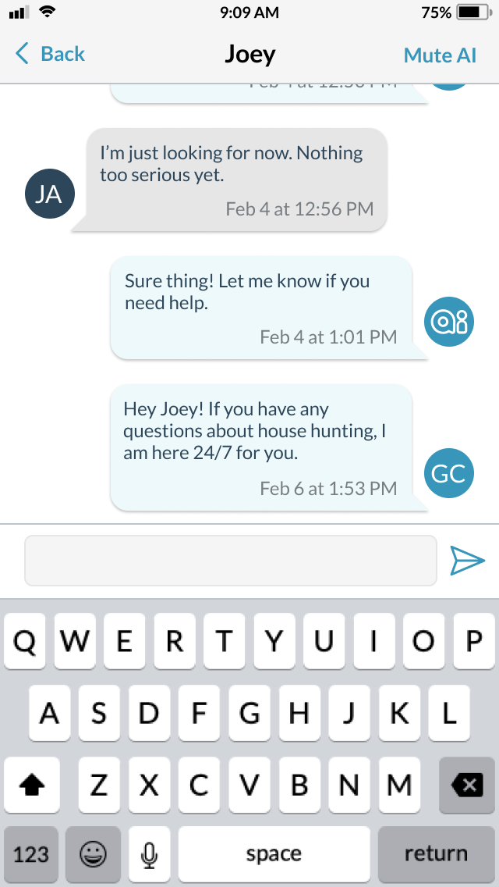
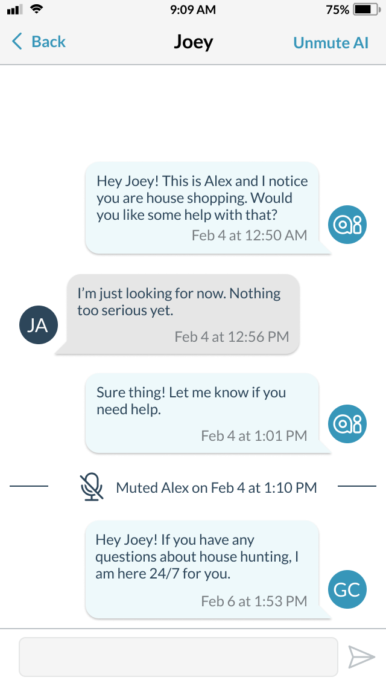

# Essential Developer Mentoring

## User session management

#### Currently we are using a singleton name MyAccount, that we access throughout the project to get access to variables. I would like to find an approach that:

* Handles storage of a token in keychain
* Allows us to access user account variables in each file, without relying on singleton and shared state
* Handles session expiration

## Text Message Chat

### As a user, I need a screen that shows me my text history with a lead and gives me the ability to respond so that I don’t miss communications and respond in a timely manner.

#### Primary goals

* When a user taps on the text button at the top of the lead details screen or on the cell phone number and chooses text, go to this screen. 
* Name of lead will appear at the top
* Back button in top left will take you back to the lead details screen
* Compose text view will be at the bottom of the screen and keyboard will pop up when the box is tapped.
  *  This text view will need to scale vertically if text is too large to fit inside
  *  Ideally, the message view will shift upwards as the text view scales, mimicing iMessage behavior
* A send button will need to be enabled when something has been typed
* When a message is sent from this screen, reload messages with the last message displayed in the next text bubble if we get a success from the text message API. 
___
* Load messages starting from the bottom
* Reload next set of messages when you reach top of screen
  * Screen should remain on the message that was last viewed before reloading
* Most recent message should display at the bottom of the screen
* Message is shown on right side of screen (sender side) when the mdid in the fromMember object (message.messageDetail[0].fromMember.mdid) is equal to the account object mdid (MyAccount.sharedInstance.mdid)

#### Secondary goals

* There will be a mute AI button if an AI conversation is going on.
  * Title will show "Mute AI" when AIStatus is .active
  * Title weill show "Unmute AI" when AIStatus is .muted      

##### Notes

* Alex is the name of the AI
* We can ignore the message icons and just use initials of sender
* There is a possibility of newline characters and carriage return in messages
* We can ignore message type for the most part. We use that to determine which icon is being displayed, but we'll be ignoring icons

